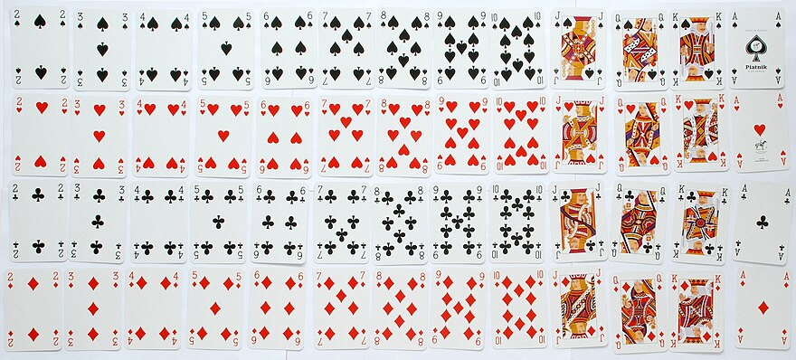

# Blackbaud Java interview question

This readme contains [instructions for setting up](#instructions) the code for the interview.
It also contains the [first question](#question).

Completing this problem before your scheduled interview is **optional**.

---

# Java interview question setup

The `src` directory contains starter code for your upcoming coding interview.
Prior to your interview, please take some time to ensure you can edit the files and compile the
application.

During the coding interview you will edit the attached solution files in an IDE while sharing your
screen.

The code targets Java 11. You can use any IDE or code editor you prefer! Some recommendations are IntelliJ, Eclipse, VSCode, or Notepad++.

If you are unable to use an IDE during the interview, please reach out to the recruiter to discuss options. Your interviewers should be able
to accommodate a browser-based option using [https://vscode.dev](https://vscode.dev). Using vscode.dev requires signing in with either a GitHub
or Microsoft account.

## Helpful links

-   [OpenJDK 11 (if you don't already have Java on your machine!)](https://docs.microsoft.com/en-us/java/openjdk/download#openjdk-11)
-   [IntelliJ Community Edition (Highly recommended!)](https://www.jetbrains.com/idea/download/)
-   [VS Code with Java support](https://code.visualstudio.com/docs/languages/java)
-   [Notepad++](https://notepad-plus-plus.org/downloads/)
-   [Eclipse](https://www.eclipse.org/downloads/)

---

# Deck of cards interview question

## The Deck of cards

You have been given an object model for a
[standard deck](https://en.wikipedia.org/wiki/Standard_52-card_deck)
of 52 [playing cards](https://en.wikipedia.org/wiki/Playing_card).
(Follow links for more explanation of these terms, if you're not familiar with a deck of cards.)

The classes in the object model are:
-   `Deck`: A collection of 52 `cards`
-   52 `Cards`: The value of each card is the combined `rank` and `suit`
-   13 `Ranks`: Numbers 2-10, Jack, Queen, King, and Ace
-   4 `Suits`: Spades, Hearts, Diamonds, and Clubs
-   no jokers

A new deck always has the same order for the cards.

The code in `App.java` deals all the cards and displays the value (rank & suit) of each.

## Part 1 - Shuffling

Requirement: The deck of cards needs to be shuffled a given number of times.

After shuffling, deal all the cards and display the value (rank & suit) of each.
